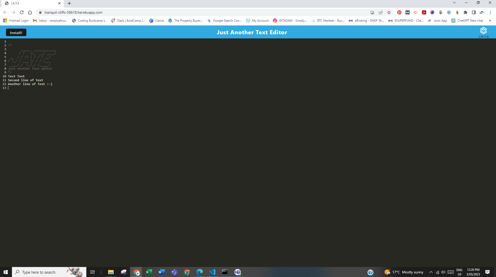

# Ben-Armstrong-PWA-Text-Editor
Module 19: Progressive Web Applications (PWA) Challenge: Text Editor

## Your Task
Your task is to build a text editor that runs in the browser. The app will be a single-page application that meets the PWA criteria. Additionally, it will feature a number of data persistence techniques that serve as redundancy in case one of the options is not supported by the browser. The application will also function offline.

To build this text editor, you will start with an existing application and implement methods for getting and storing data to an IndexedDB database. You will use a package called `idb`, which is a lightweight wrapper around the IndexedDB API. It features a number of methods that are useful for storing and retrieving data, and is used by companies like Google and Mozilla.

You will deploy this full-stack application to Heroku using the [Heroku Deployment Guide on The Full-Stack Blog](https://coding-boot-camp.github.io/full-stack/heroku/heroku-deployment-guide).

## User Story

```md
AS A developer
I WANT to create notes or code snippets with or without an internet connection
SO THAT I can reliably retrieve them for later use
```

## Acceptance Criteria

```md
GIVEN a text editor web application
WHEN I open my application in my editor
THEN I should see a client server folder structure
WHEN I run `npm run start` from the root directory
THEN I find that my application should start up the backend and serve the client
WHEN I run the text editor application from my terminal
THEN I find that my JavaScript files have been bundled using webpack
WHEN I run my webpack plugins
THEN I find that I have a generated HTML file, service worker, and a manifest file
WHEN I use next-gen JavaScript in my application
THEN I find that the text editor still functions in the browser without errors
WHEN I open the text editor
THEN I find that IndexedDB has immediately created a database storage
WHEN I enter content and subsequently click off of the DOM window
THEN I find that the content in the text editor has been saved with IndexedDB
WHEN I reopen the text editor after closing it
THEN I find that the content in the text editor has been retrieved from our IndexedDB
WHEN I click on the Install button
THEN I download my web application as an icon on my desktop
WHEN I load my web application
THEN I should have a registered service worker using workbox
WHEN I register a service worker
THEN I should have my static assets pre cached upon loading along with subsequent pages and static assets
WHEN I deploy to Heroku
THEN I should have proper build scripts for a webpack application
```
## Grading Requirements
This Challenge is graded based on the following criteria:
* Uses IndexedDB to create an object store and includes both GET and PUT methods
* The application works without an internet connection
* Automatically saves content inside the text editor when the DOM window is unfocused
* Bundled with webpack
* Create a service worker with workbox that Caches static assets
* The application should use babel in order to use async / await
* Application must have a generated `manifest.json` using the `WebpackPwaManifest` plug-in
* Can be installed as a Progressive Web Application
* Application deployed to Heroku at live URL with build scripts
* Application loads with no errors
* Application GitHub URL submitted
* GitHub repo contains application code
* Application user experience is intuitive and easy to navigate
* Application user interface style is clean and polished
* Application resembles the mock-up functionality provided in the Challenge instructions
* Repository has a unique name
* Repository follows best practices for file structure and naming conventions
* Repository follows best practices for class/id naming conventions, indentation, quality comments, etc.
* Repository contains multiple descriptive commit messages
* Repository contains quality README file with description, screenshot, and link to deployed application

## Table of Content
* [Credits](#credits)
* [What-I-Learned](#what-i-learned)
* [Deployment](#deployment)
* [Installation](#installation)
* [Usage](#usage)
* [Made-With](#made-with)
* [License](#license)

# Credits
* Ben Armstrong https://github.com/BenArmstrong81 <br>

*With special thanks to The University of Adelaide Full Stack Web Development Class.*

# What-I-Learned
Building on the two thirds of the course and extending on from the last couple weeks using Node.js we learnt how to incororate MongoDB (NoSQL) along with Mongoose. The modules in class included but not limited to; MongoDB, Mongoose, Virtuals, CRUD, Subdocuments, Models, Aggregates.

# Deployment

[Click here for the deployed application](https://tranquil-cliffs-58618.herokuapp.com/) <br/>

# Installation  
To install packages:
```
npm install
```
Next the application will build and bundle files:
```
npm run build
```
Lastly to launch the application:
```
npm run start
```
# Usage
Deployed Application on Heroku:


Application Installation:


Deployed Application on Heroku and Installed Application Interface:


Deployed Application Manifest:


Deployed Application Service Workers:


Deployed Application Data Base:


# Made-With


  
 

# License

Please refer to the LICENSE in the repo. <br/>
